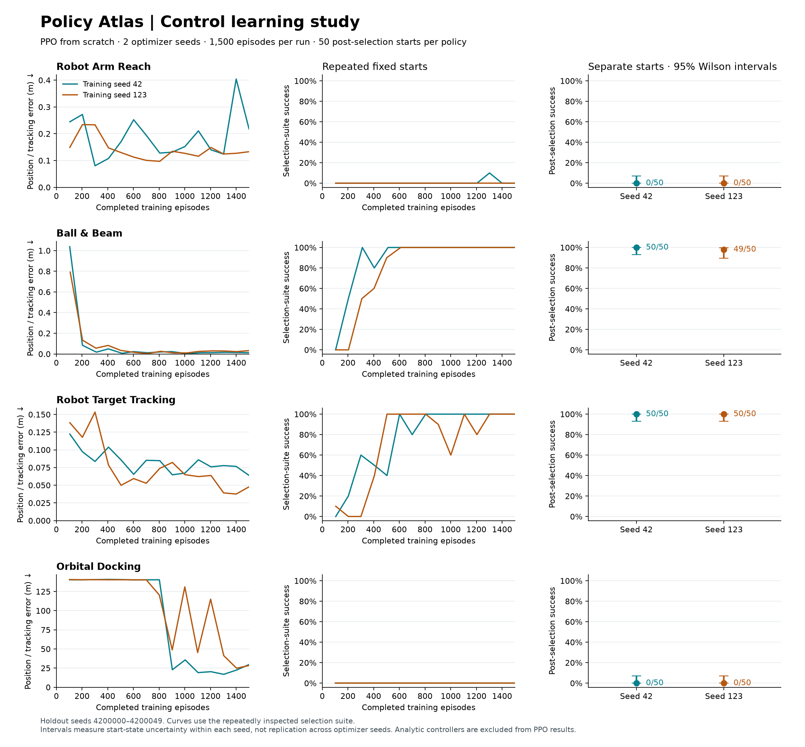

# Policy Atlas: September 2026 audit and expansion

## Scope and baseline

Reviewed the PPO likelihood, GAE boundaries, value scaling, episode-aligned
updates, checkpoint/restart paths, curriculum and demonstration disclosures,
REST/WebSocket control flow, evaluation tooling, and browser data flow. The
existing 16 tasks and historical evidence are documented in
[the earlier audit](scientific-and-ux-audit.md). Those historical results are
specific to their recorded engine and optimizer seed, not proof of the new
engine's learning performance.

Baseline: 236 backend tests passed (324.880 s with one CPU thread), 30 frontend
contracts passed, and the production build passed. No RL service was running
on the host at audit start. Existing checkpoint volumes and historical
worktrees are retained.

## Reproduced issues and corrections

1. **PPO KL guard:** an already over-budget minibatch still took another
   optimizer step. The guard now runs before mutation; skipped updates report
   finite diagnostics and an explicit optimizer-step count. Empty rollouts
   are rejected rather than producing NaN means.
2. **Disconnected browser:** mutating the client set during an awaited send
   could terminate the broadcaster. Sends now use a membership snapshot and
   concurrent bounded delivery. Invalid WebSocket payloads and busy commands
   return errors using the same request validation as REST.
3. **Silent training failures:** a worker exception left connected interfaces
   with stale running status. Failures now produce an error and final stopped
   status, also available after reconnecting.
4. **Unnecessary evaluation computation:** deterministic tests constructed
   distributions and sampled unused entropy. An action-only prediction path
   produces the same continuous and binary decisions without random draws.
5. **Implicit CPU configuration:** the container default was 12 PyTorch
   threads. Small networks now default to one configurable CPU thread; the
   setting is included in checkpoint provenance. This is a conservative local
   default, not a claim of optimal throughput for every network or machine.
6. **Expensive checkpoint restores:** compatible saved actors now load before
   considering a demonstration warm start. Their saved demonstration metadata
   is restored with them; retraining is only required for a fresh actor.
7. **Initial browser payload:** charts load on opening diagnostics. Initial
   JavaScript decreased from 638.97 KB to 257.81 KB (191.00 to 79.49 KB gzip),
   including the new scene renderers and comparison panel.
   Full chart functionality remains available on demand.
8. **False archive-restore success:** an archive from a different engine could
   be swapped into the active directory and immediately rejected, while the
   caller reported success. Engine and evaluation-suite compatibility are now
   checked before moving any active files, and the archive controls disclose
   the same compatibility decision.

The optimizer protocol is now version 19. Source hashes still prevent silently
resuming weights under a changed engine. Older policies remain archived; new
results must identify the new engine rather than inherit historical claims.

## Inference microbenchmark

PyTorch 2.4.1+cu124, CPU, 12 observations, 2 continuous actions, the existing
256/256/128 network; median of three 200-call repeats after 20 warmup calls.
The machine was shared with the regression suite, so these are local
measurements, not an end-to-end training-speed guarantee.

| CPU threads | Previous density path, calls/s | Action-only path, calls/s |
| ---: | ---: | ---: |
| 1 | 2,360.7 | 11,208.2 |
| 2 | 3,179.5 | 12,612.6 |
| 4 | 2,817.2 | 13,623.7 |
| 12 | 1,552.5 | 17,139.1 |

The one-thread action-only path was 4.75× faster than its same-thread baseline.
Inference throughput alone does not determine the best thread count for PPO
minibatch updates or behavior cloning.

## Four new task contracts

| Task | Model | Completion criterion |
| --- | --- | --- |
| Orbital Docking | Linear planar Hill/Clohessy-Wiltshire dynamics, RK4; metres/seconds | Within 2 m and below 0.08 m/s for 10 s |
| Robot Arm Reach | Two planar links with ideal damped acceleration servos | Within 8 cm and below 0.1 m/s for 1 s |
| Robot Target Tracking | Same arm following a visible periodic target | Within 12 cm for at least 90 of the final 100 steps |
| Ball & Beam | Reduced no-slip solid-ball model with bounded beam actuator | Within 4.5 cm, below 0.06 m/s and 0.035 rad tilt for 2 s |

Each task exposes remaining time and success counters to avoid hidden task
state. The arm's target position and velocity are observable. These are
educational models with stated approximations, not hardware-certified systems.

Physical tests compare unforced orbital propagation to its analytic solution,
verify link lengths and downhill rolling, check seeded transition identity,
and require a finite terminal within the declared horizon. Reference
controllers passed 10/10 seeded starts per task; zero action failed every
canonical task. Reference success is evidence of task feasibility, not evidence
that PPO learned it. The new tasks use no demonstration warm start.

## Comparison lab

The new read-only diagnostic compares frozen policy, zero action, uniformly
random actions, and (where defined) an analytic reference controller on exactly
the same initial-state seeds. It reports individual trials, success intervals,
reward dispersion, and task metrics. It does not mutate weights or checkpoints.
The fixed diagnostic seed range begins at 3,000,000. Repeated use makes these
diagnostics unsuitable for claiming an untouched holdout.

Reference replays include full geometry and an explicit controller label, so
they cannot be confused with learned-policy evidence.

## Scientific references

- [Gymnasium: intrinsic deadlines and external truncation](https://gymnasium.farama.org/tutorials/gymnasium_basics/handling_time_limits/).
- [OpenAI Spinning Up: PPO and KL early stopping](https://spinningup.openai.com/en/latest/algorithms/ppo.html).
- [MIT 16.346 Lecture 26: Clohessy-Wiltshire equations](https://ocw.mit.edu/courses/16-346-astrodynamics-fall-2008/e4f0632a9f1c98f7e9b25492e1a30eb1_lec_26.pdf).

## Study design and pilot

The [250-episode pilot](reports/2026-09-10-control-pilot.json) used training seeds
42 and 123, checkpoints every 50 episodes, and 50 post-selection starts per
policy at seeds 4,100,000–4,100,049. It did not establish a solved task under
the campaign criteria. Ball & Beam reached 24/50 successes in one seed;
the arm tasks reduced position error but failed their full success conditions;
both orbital policies escaped the rendezvous region. These observations
motivated increasing the later budget, so the pilot is development evidence.

The later study fixes a 1,500-episode budget for each task/seed pair, saves
approximately every 100 episodes at episode-aligned PPO boundaries, and selects
the first checkpoint meeting the existing fixed-suite criterion. With ten
selection starts, the >=0.7 Wilson lower-bound requirement effectively requires
10/10 successes. If no checkpoint qualifies, the final-budget checkpoint is
evaluated and remains labelled unsolved.

Each selected policy then faces 50 starts at seeds 4,200,000–4,200,049. The
holdout results do not choose checkpoints, alter the training budget, or stop
training. We retained the two completed arm runs from an interrupted live
campaign and restarted the unfinished Ball & Beam run from its declared seed
in an isolated instance. The source report records the interruption. Separate
reports are combined only if engine, budgets, selection rules, seeds, and
holdout protocols agree and every requested task/seed pair is present once.

Two training seeds establish limited replication, not a broad
claim of optimizer robustness. These evaluations vary initial conditions;
they do not establish robustness to unmodelled forces or real hardware.

The study uses the existing 256/256/128 actor-critic, the shared PPO update
settings, and each task's declared discount. Orbital Docking uses `gamma=1.0`;
the other three additions use `gamma=0.995`. Every run begins from a fresh
seeded actor. The four new tasks receive no expert demonstrations, curriculum
starts, or reference-controller guidance in their observations.

## Final learning results

All eight runs completed their 1,500-episode budgets: **12,000 episodes and
3,639,309 environment steps**, followed by 400 post-selection evaluation
episodes. The [composed report](reports/2026-09-10-control-study.json) retains
all trials and hashes of its two source reports. The source reports preserve
the [interrupted campaign](reports/2026-09-10-control-study-part1.json) and
the [completed isolated continuation](reports/2026-09-10-control-study-part2.json).

| Task | Training seed | Selected episode | Separate-start successes | 95% Wilson interval | Mean error (m) |
| --- | ---: | ---: | ---: | ---: | ---: |
| Robot Arm Reach | 42 | 1,500 | 0/50 | 0–7.1% | 0.233 |
| Robot Arm Reach | 123 | 1,500 | 0/50 | 0–7.1% | 0.164 |
| Ball & Beam | 42 | 312 | 50/50 | 92.9–100% | 0.0179 |
| Ball & Beam | 123 | 611 | 49/50 | 89.5–99.6% | 0.0182 |
| Robot Target Tracking | 42 | 602 | 50/50 | 92.9–100% | 0.0591 |
| Robot Target Tracking | 123 | 504 | 50/50 | 92.9–100% | 0.0546 |
| Orbital Docking | 42 | 1,500 | 0/50 | 0–7.1% | 29.672 |
| Orbital Docking | 123 | 1,500 | 0/50 | 0–7.1% | 28.481 |

Errors are mean terminal position error across starts, except tracking, whose
per-episode metric averages the final 100 steps. The success criteria also
include the task-specific dwell, speed, or tracking requirements. Confidence
intervals concern initial-state variation within one trained policy; they do
not describe uncertainty across training seeds.



Ball & Beam and target tracking passed the selection and post-selection
criteria in both training seeds. Reach and docking remain unsolved under this
budget. Reach approached the target but did not establish a stable capture;
the orbital policies stopped escaping but remained roughly 28–30 m away on
average. These are useful failures to investigate, not solved tasks. The
report's `state: incomplete` means the **all-tasks-solved criterion failed**;
all requested training and evaluation runs finished.

No success threshold, checkpoint-selection rule, or training budget was changed
after observing these results. A subsequent study could compare a disclosed
near-target curriculum or demonstration-assisted initialization against this
from-scratch baseline, with new evaluation starts and more training seeds.
Those interventions were not applied to the reported policies.

## Predefined controller baselines

The [baseline report](reports/2026-09-10-control-baselines.json) evaluates four
predefined controllers on the same 50 starts per task. The actor baseline has
initialization seed 42 and zero training steps. These controllers were not
selected or fitted using the study outcomes.

| Task | Untrained actor | Zero action | Random actions | Analytic reference |
| --- | ---: | ---: | ---: | ---: |
| Robot Arm Reach | 0/50 | 0/50 | 0/50 | 50/50 |
| Ball & Beam | 5/50 | 5/50 | 0/50 | 50/50 |
| Robot Target Tracking | 0/50 | 0/50 | 0/50 | 50/50 |
| Orbital Docking | 0/50 | 0/50 | 0/50 | 50/50 |

Some Ball & Beam starts already satisfy the settling region, which explains
the zero-action successes. Every raw trial is retained, including failures.

## Reproduce and inspect

Use a separate checkpoint directory and backend instance for unattended
campaigns. The public lab has one shared active scenario; user interaction can
change it. The runner rejects a changed scenario instead of mixing experiments.

```bash
# Run inside the backend runtime, against the isolated backend's own API.
python benchmark_all.py --base-url http://127.0.0.1:8901 --execute \
  --scenarios robot-reach,ball-beam,robot-tracking,orbital-docking \
  --seeds 42,123 --max-episodes 1500 --checkpoint-every 100 --full-budget \
  --holdout-episodes 50 --holdout-seed-base 4200000 \
  --checkpoint-root /tmp/control-checkpoints --output /tmp/control-study.json

python benchmark_baselines.py --episodes 50 --seed-base 4200000 \
  --output /tmp/control-baselines.json
```

The runtime image copies the application; copy the named benchmark scripts
from `backend/` into `/app/` before running them there. `plot_control_study.py`
renders the recorded JSON with matplotlib. `combine_study_reports.py` validates
and composes disjoint completed runs after an interrupted campaign.

For the recorded isolated runs, the backend used `--network none`, no published
port or shared checkpoint volume, and `CHECKPOINT_DIR=/tmp/control-checkpoints`.
The runner called that container's loopback API. `TORCH_NUM_THREADS`,
`OMP_NUM_THREADS`, and `MKL_NUM_THREADS` were all `1`. Copy the checkpoint
directory out before removing a disposable study container.

`package_study_policies.py` validates the selected tensor, metadata, seed,
episode, engine, and evaluation suite before packaging policies. Installation
adds archived branches and never replaces active policy files. In the lab,
open **All saved runs → Archived branches** to restore a study policy.
All eight selected policies are installed and pass the current engine and
evaluation-suite compatibility checks. Their archive paths and tensor hashes
are recorded in the [policy manifest](reports/2026-09-10-selected-policies.json).
The complete isolated study checkpoint tree was copied to
`data/control-study-checkpoints/`; all 181 files were verified by SHA-256 before
the temporary container was removed. Weights stay in local runtime storage
and are excluded from Git.

## Release verification

- Complete backend suite: **258 tests passed**, 347.771 s. This includes the
  existing scientific tests and new optimizer, WebSocket, failure, physics,
  evaluation, restore, and package-import regressions.
- Standalone smoke: all **20 scenarios** passed finite observation/reward,
  PPO-update, checkpoint round-trip, and targeted physical checks.
- Frontend: **30 contract tests passed**; TypeScript and production builds passed.
- Disposable live integration: catalog → scenario switch → WebSocket frames →
  PPO update → evaluation → reset → archive restore; all four reference replay
  endpoints and paired-controller comparisons passed.
- Browser: desktop and 390×844 phone layouts inspected; reference scenes,
  comparison results, scenario changes, and lazy-loaded diagnostics verified.
  The production page produced no browser errors during its verification.
- The local page and health endpoint responded through Tailscale port 8900.
  The canonical frontend remains loopback-bound, with a tailnet-only TCP forward.

The release application fingerprint is
`2ac217ec836b9b35763104d7b63893105062e1e67da26102cee7e5ebfba462b1`.
The deployed application, study evaluator, baseline evaluator, and selected
policy packages agree on this fingerprint. Research scripts live outside the
fingerprinted application directory and record their own inputs and report
composition hashes.
